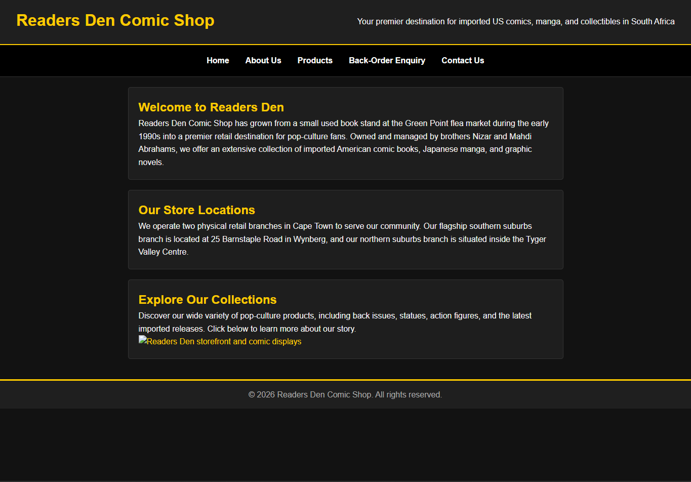
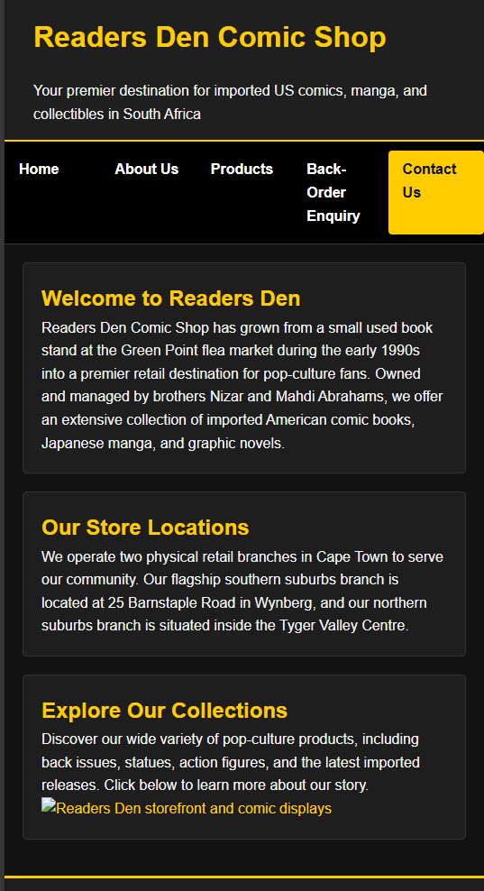

Project Title
Readers Den Comic Shop Website

Student Information
* Diego Rodrigues Da Silva
* ST10528850
* WEDE5020

Project Overview
Readers Den Comic Shop is an established retailer specializing in imported US comic books, manga, and pop-culture collectibles. This website project provides an online platform to showcase store locations, merchandise catalogs, and back-order enquiry services.

Website Goals and Objectives
* Provide clear information about physical store locations and operating hours.
* Showcase imported comics, graphic novels, and collectibles.
* Enable customers to submit back-order and product enquiries online.

 Key Features and Functionality
* Responsive multi-page layout (`index.html`, `about.html`, `products.html`, `enquiry.html`, `contact.html`).
* Consistent dark mode theme with yellow accents across all pages.
* Interactive HTML form for customer enquiries.
* Global navigation system linking all pages.

Timeline and Milestones
* **Phase 1:** Project proposal, research, and sitemap planning.
* **Phase 2:** HTML structure implementation and external CSS styling.
* **Phase 3:** JavaScript functionality, SEO optimization, and final documentation.

Sitemap
* `index.html` - Homepage with introductory content and store overview.
* `about.html` - Background history of Readers Den and management team.
* `products.html` - Showcase of available comic and collectible categories.
* `enquiry.html` - Customer back-order and product enquiry form.
* `contact.html` - Physical store addresses, contact details, and layout.

Responsive Design & Testing Evidence
* Desktop View: Multi-column layout featuring a horizontal flexbox navigation bar and header hierarchy.
* Tablet View: Scaled elements that maintain visual clarity
* Mobile View: Single-colum vertical layout with stacked navigation links using max width breakpoints.

Changelog
* v1.0: Initial project file structure created with NetBeans, including `css`, `js`, and `images` folders.
* v1.1: Developed all five HTML pages using semantic tags and structural comments.
* v1.2: Implemented global external stylesheet (`styles.css`) featuring a custom dark mode and yellow accent palette.
* v1.3: Applied CSS resets, base body rules, flexbox navigation layout, and responsive mobile media breakpoints.

Rferences
* Readers Den Comic Shop. Official Website and Store Information. Available online.

Evidence:

